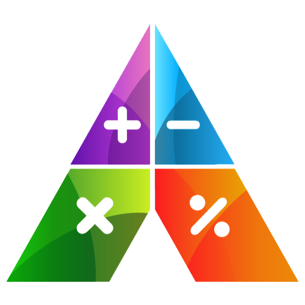

# MG CALCULADORA



## Descripción
MG CALCULADORA es una aplicación de calculadora diseñada para facilitar a los estudiantes la realización de operaciones matemáticas básicas. Con una interfaz intuitiva y fácil de usar, los usuarios pueden realizar rápidamente sumas, restas, multiplicaciones y divisiones, obteniendo resultados precisos al instante.

## Instalación
Sigue los siguientes pasos para instalar y configurar correctamente Calculator_app:

1. Asegúrate de tener Flutter instalado en tu sistema. Si no lo tienes, sigue las instrucciones de instalación en [este enlace](https://flutter.dev/docs/get-started/install).


2.Instala el paquete `flutter_launcher_icons` siguiendo las instrucciones detalladas en [este enlace](https://pub.dev/packages/flutter_launcher_icons).

3. Luego de la instalación del paquete `flutter_launcher_icons` ejecutando el siguiente comando en tu terminal:

```ruby

flutter pub add flutter_launcher_icons

```

4.Instala el paquete `flutter_launcher_icons` siguiendo las instrucciones detalladas en [este enlace](https://pub.dev/packages/math_expressions).
5.  Luego de la instalación del paquete  `math_expressions` ejecutando el siguiente comando en tu terminal:

```ruby

flutter pub add math_expressions

```


¡Listo! Ahora deberías poder ejecutar y utilizar Calculator_app en tu dispositivo o emulador.

Si tienes alguna pregunta o problema durante la instalación, no dudes en crear un issue en este repositorio.

¡Espero que encuentres útil esta aplicación! Si tienes alguna sugerencia o mejora, no dudes en contribuir al proyecto.
